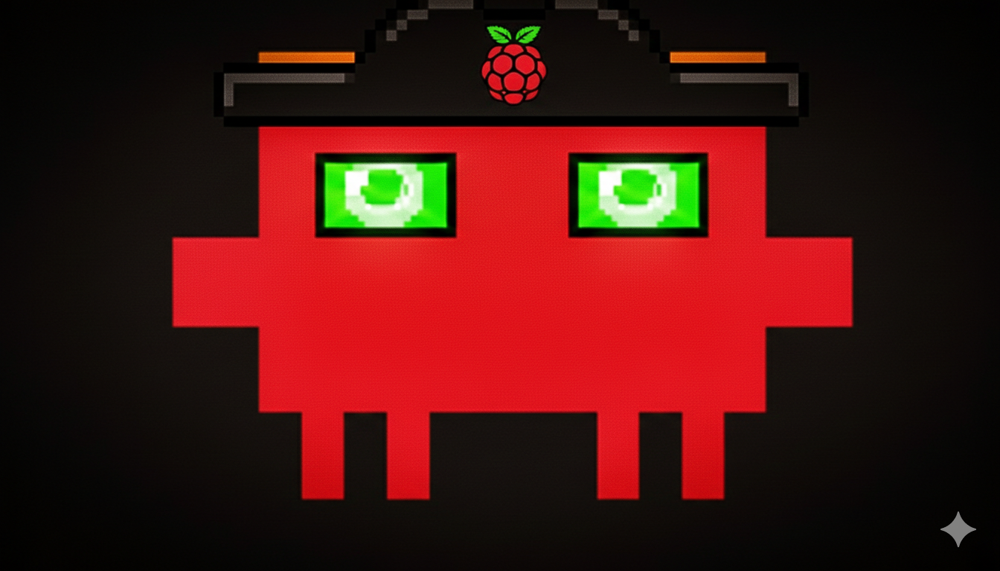

<p align="center">
  
</p>

<h1 align="center">Moltbot Pi</h1>

<p align="center">
  <strong>A lightweight, memory-efficient AI-powered Telegram bot designed for Raspberry Pi Zero 2W</strong>
</p>

<p align="center">
  <a href="#-features">Features</a> •
  <a href="#-quick-start">Quick Start</a> •
  <a href="#-hardware">Hardware</a> •
  <a href="#-installation">Installation</a> •
  <a href="#-usage">Usage</a> •
  <a href="#-api-reference">API</a>
</p>

<p align="center">
  
  
  
  
</p>

<p align="center">
  
  
  
</p>

---

## 📋 Table of Contents

- [Overview](#-overview)
- [Performance](#-performance)
- [Features](#-features)
- [Quick Start](#-quick-start)
- [Hardware Requirements](#-hardware-requirements)
- [Installation](#-installation)
- [Configuration](#-configuration)
- [Usage](#-usage)
- [LCD Display Setup](#-lcd-display-setup)
- [Running as a Service](#-running-as-a-service)
- [Architecture](#-architecture)
- [Troubleshooting](#-troubleshooting)
- [Contributing](#-contributing)
- [License](#-license)

---

## 🎯 Overview

**Moltbot Pi** is a production-ready, lightweight implementation of an AI-powered Telegram bot specifically optimized for resource-constrained devices. Built with a modular architecture and lazy-loading system, it delivers full AI capabilities while consuming minimal system resources.

### Why Moltbot Pi?

| Challenge | Solution |
|-----------|----------|
| Limited RAM (512MB) | Lazy-loading architecture, only loads modules when needed |
| Slow storage (SD Card) | Minimal dependencies (34MB vs 700MB) |
| Limited CPU | Efficient async operations, no heavy processing |
| Power constraints | Low idle consumption (~85MB RAM) |

---

## 📊 Performance

<table>
<tr>
<td>

### Memory Footprint

```
┌────────────────────────────┐
│     Moltbot Pi: 85 MB      │
│     ████████░░░░░░░░░░░░   │
│                            │
│     Original:  400+ MB     │
│     ████████████████████   │
└────────────────────────────┘
```

</td>
<td>

### Comparison

| Metric | Moltbot Pi | Original |
|--------|------------|----------|
| RAM (idle) | **85 MB** | 400 MB |
| RAM (active) | **120 MB** | 600 MB |
| node_modules | **34 MB** | 700 MB |
| Packages | **101** | 1000+ |
| Startup | **~3s** | ~10s |

</td>
</tr>
</table>

---

## ✨ Features

<table>
<tr>
<td width="50%">

### ✅ Included

- 🤖 **AI Chat** - DeepSeek integration (GPT-compatible)
- 📁 **File Vault** - Encrypted file storage on Pi
- ⏰ **Reminders** - Natural language scheduled messages
- 🏠 **Smart Home** - TP-Link Tapo device control
- 📊 **System Monitoring** - RAM, CPU temp, uptime, disk
- 🔧 **Remote Shell** - Run bash commands via Telegram
- ⚡ **GPIO Control** - Turn pins on/off, read state
- 🔄 **System Control** - Reboot/shutdown via Telegram
- 🖥️ **LCD Display** - Waveshare 1.44" HAT support
- 🔐 **Admin Protection** - Restrict dangerous commands

</td>
<td width="50%">

### ❌ Disabled (Saves Memory)

- 🌐 Browser automation (Playwright)
- 🖼️ Image processing (Sharp)
- 📱 WhatsApp Web (Baileys)
- 📄 PDF parsing (pdfjs)
- 🧠 Local LLM (llama.cpp)
- 🎨 Canvas rendering

> These features can be enabled on devices with more RAM by changing the profile.

</td>
</tr>
</table>

---

## 🚀 Quick Start

```bash
# Clone the repository
git clone https://github.com/Pavelevich/moltbot-pi.git
cd moltbot-pi

# Install dependencies
npm install --omit=optional

# Configure environment
cp .env.example .env
nano .env  # Add your API keys

# Run the bot
node --experimental-strip-types src/bot.ts
```

---

## 🔧 Hardware Requirements

### Minimum Configuration

| Component | Specification | Notes |
|-----------|---------------|-------|
| **Board** | Raspberry Pi Zero 2W | Quad-core ARM Cortex-A53, 512MB RAM |
| **Storage** | MicroSD 8GB+ | Class 10 / U1 recommended |
| **Power** | 5V 2.5A USB | Stable power supply required |
| **Network** | WiFi 802.11 b/g/n | Built-in on Pi Zero 2W |

### Optional: LCD Display Module

<table>
<tr>
<td width="50%">

**Waveshare 1.44" LCD HAT**
- Controller: ST7735S
- Resolution: 128 × 128 pixels
- Interface: SPI
- Colors: 65K RGB

</td>
<td width="50%">

**GPIO Pinout**
```
RST ──── GPIO 27
DC  ──── GPIO 25
BL  ──── GPIO 24
CS  ──── GPIO 8 (CE0)
CLK ──── GPIO 11 (SCLK)
DIN ──── GPIO 10 (MOSI)
```

</td>
</tr>
</table>

### GPIO Reference (Buttons & Joystick)

```
┌─────────────────────────────────────────┐
│           Waveshare 1.44" HAT           │
├─────────────────────────────────────────┤
│  KEY1 ─── GPIO 21    JOY UP ─── GPIO 6  │
│  KEY2 ─── GPIO 20    JOY DN ─── GPIO 19 │
│  KEY3 ─── GPIO 16    JOY LT ─── GPIO 5  │
│                      JOY RT ─── GPIO 26 │
│                      JOY OK ─── GPIO 13 │
└─────────────────────────────────────────┘
```

---

## 📦 Installation

### Prerequisites

- Raspberry Pi OS (64-bit Lite recommended)
- Node.js 22 or higher
- Internet connection

### Step 1: Install Node.js 22

```bash
# Update system
sudo apt update && sudo apt upgrade -y

# Install Node.js 22
curl -fsSL https://deb.nodesource.com/setup_22.x | sudo -E bash -
sudo apt-get install -y nodejs

# Verify installation
node --version  # Expected: v22.x.x
```

### Step 2: Clone & Install

```bash
# Clone repository
git clone https://github.com/Pavelevich/moltbot-pi.git
cd moltbot-pi

# Install dependencies (lightweight)
npm install --omit=optional --ignore-scripts

# Verify installation
ls node_modules | wc -l  # Expected: ~100 packages
du -sh node_modules      # Expected: ~34MB
```

### Step 3: Configure

```bash
# Create environment file
cp .env.example .env

# Edit configuration
nano .env
```

---

## ⚙️ Configuration

### Environment Variables

Create a `.env` file in the project root:

```env
# ═══════════════════════════════════════════════════════════
# MOLTBOT PI - CONFIGURATION
# ═══════════════════════════════════════════════════════════

# Telegram Bot Token (Required)
# Get from: https://t.me/BotFather
TELEGRAM_BOT_TOKEN=your_telegram_bot_token

# DeepSeek API Key (Required)
# Get from: https://platform.deepseek.com
DEEPSEEK_API_KEY=your_deepseek_api_key

# Telegram Admin ID (Optional)
# Your Telegram user ID for admin commands
# Get your ID by sending /whoami to the bot
TELEGRAM_ADMIN_ID=your_telegram_user_id

# Vault Password (Optional)
# Password for encrypting stored files
VAULT_PASSWORD=your_secret_password

# Tapo Smart Home (Optional)
# TP-Link Tapo account for /home commands
TAPO_EMAIL=your_tapo_email@example.com
TAPO_PASSWORD=your_tapo_password

# Profile (Optional - defaults to raspberry-pi)
MOLTBOT_PROFILE=raspberry-pi
```

### Obtaining API Keys

<details>
<summary><b>📱 Telegram Bot Token</b></summary>

1. Open Telegram and search for **@BotFather**
2. Send `/newbot` command
3. Choose a display name (e.g., "My Pi Assistant")
4. Choose a username ending in `bot` (e.g., "my_pi_assistant_bot")
5. Copy the token provided (format: `123456789:ABCdefGHI...`)

</details>

<details>
<summary><b>🤖 DeepSeek API Key</b></summary>

1. Visit [platform.deepseek.com](https://platform.deepseek.com)
2. Create an account or sign in
3. Navigate to **API Keys** section
4. Click **Create new API key**
5. Copy the key (format: `sk-...`)

**Pricing:** ~$0.14 per 1M tokens (very affordable)

</details>

---

## 🎮 Usage

### Starting the Bot

```bash
# Development mode
node --experimental-strip-types src/bot.ts

# With environment variables
source .env && node --experimental-strip-types src/bot.ts

# Background process
nohup node --experimental-strip-types src/bot.ts > bot.log 2>&1 &

# View logs
tail -f bot.log
```

### Telegram Commands

#### Public Commands (Everyone)

| Command | Description |
|---------|-------------|
| `/start` | Welcome message & command list |
| `/help` | Show all available commands |
| `/status` | System status (RAM, CPU temp, uptime) |
| `/temp` | CPU temperature |
| `/disk` | Disk space usage |
| `/network` | Network info (IP, hostname, WiFi) |
| `/uptime` | System uptime |
| `/whoami` | Get your Telegram user ID |
| `[any text]` | Chat with DeepSeek AI |

#### File Vault (Encrypted Storage)

| Command | Description |
|---------|-------------|
| `/vault` | List stored files |
| `/vault get <name>` | Retrieve a file |
| `/vault delete <name>` | Delete a file |
| `[send any file]` | Store file in encrypted vault |

#### Reminders

| Command | Description |
|---------|-------------|
| `/remind in 30 minutes <msg>` | Remind in X minutes |
| `/remind at 14:00 <msg>` | Remind at specific time |
| `/remind tomorrow at 9:00 <msg>` | Remind tomorrow |
| `/reminders` | List active reminders |
| `/remind cancel <id>` | Cancel a reminder |

#### Smart Home (Tapo)

| Command | Description |
|---------|-------------|
| `/home` | Status of all devices |
| `/home devices` | List all devices |
| `/home on <device>` | Turn device on |
| `/home off <device>` | Turn device off |
| `/home toggle <device>` | Toggle device |
| `/home temp` | Temperature sensors |
| `/home sensors` | All sensor readings |

#### Admin Commands (Requires TELEGRAM_ADMIN_ID)

| Command | Description |
|---------|-------------|
| `/bash <cmd>` | Run shell command on the Pi |
| `/read <path>` | Read file contents |
| `/write <path> <text>` | Write text to file |
| `/gpio <pin> <on\|off\|read>` | Control GPIO pins |
| `/reboot` | Reboot the Raspberry Pi |
| `/shutdown` | Shutdown the Raspberry Pi |

### Example Conversation

```
You: /start
Bot: 🤖 Moltbot Pi - Raspberry Pi AI Bot
     Send me any message to chat with AI.

You: /status
Bot: 📊 Moltbot Pi Status
     🖥️ Raspberry Pi Zero 2W
     ⏱️ Uptime: 2h 15m
     💾 RAM: 87 MB
     🌡️ CPU: 45.2°C
     📁 Vault: 3 files
     ⏰ Reminders: 2 active
     🏠 Tapo: Connected

You: /remind in 30 minutes check laundry
Bot: ✅ Reminder set for 3:45 PM
     "check laundry"

You: /home on living_room
Bot: 💡 OK: living_room turned ON

You: /home temp
Bot: 🌡️ Temperature
     bedroom_sensor: 22.5°C, 45% humidity
     kitchen_sensor: 24.1°C, 38% humidity

You: [sends a PDF file]
Bot: ✅ Stored "document.pdf" in vault
     Retrieve with: /vault get document.pdf

You: Explain Docker in simple terms
Bot: Docker is like a shipping container for software...
```

### Setting Up Admin Access

1. Start the bot and send `/whoami`
2. Copy your Telegram user ID from the response
3. Add it to your `.env` file:
   ```
   TELEGRAM_ADMIN_ID=123456789
   ```
4. Restart the bot

---

## 🖥️ LCD Display Setup

### Install Dependencies

```bash
# System packages
sudo apt-get install -y python3-pip python3-pil python3-numpy

# Python libraries
pip3 install st7735 spidev RPi.GPIO gpiodevice --break-system-packages

# Enable SPI interface
sudo raspi-config
# → Interface Options → SPI → Enable
```

### Display Commands

```bash
# Show custom image (128x128 recommended)
python3 scripts/display_icon.py assets/Raspclaut.png

# Show text
python3 scripts/display_icon.py "ONLINE"

# Default display (MOLTBOT logo)
python3 scripts/display_icon.py
```

### Auto-Display on Boot

Add to `/etc/rc.local` (before `exit 0`):

```bash
python3 /home/pi/moltbot-pi/scripts/display_icon.py /home/pi/moltbot-pi/assets/Raspclaut.png &
```

---

## 🔄 Running as a Service

### Create Systemd Service

```bash
sudo nano /etc/systemd/system/moltbot.service
```

```ini
[Unit]
Description=Moltbot Pi - AI Telegram Bot
After=network-online.target
Wants=network-online.target

[Service]
Type=simple
User=pi
WorkingDirectory=/home/pi/moltbot-pi
EnvironmentFile=/home/pi/moltbot-pi/.env
ExecStart=/usr/bin/node --experimental-strip-types src/bot.ts
Restart=always
RestartSec=10
StandardOutput=journal
StandardError=journal

[Install]
WantedBy=multi-user.target
```

### Service Management

```bash
# Reload systemd
sudo systemctl daemon-reload

# Enable auto-start
sudo systemctl enable moltbot

# Start service
sudo systemctl start moltbot

# Check status
sudo systemctl status moltbot

# View logs
journalctl -u moltbot -f

# Restart
sudo systemctl restart moltbot

# Stop
sudo systemctl stop moltbot
```

---

## 🏗️ Architecture

```
moltbot-pi/
├── src/
│   ├── bot.ts                 # Main entry point
│   ├── infra/
│   │   └── features.ts        # Feature flags system
│   └── compat/
│       ├── index.ts           # Compatibility layer
│       ├── lazy-playwright.ts # Browser (disabled)
│       ├── lazy-sharp.ts      # Images (disabled)
│       ├── lazy-baileys.ts    # WhatsApp (disabled)
│       ├── lazy-pdfjs.ts      # PDF (disabled)
│       └── lazy-llama.ts      # Local LLM (disabled)
├── scripts/
│   ├── display_icon.py        # LCD display control
│   ├── tapo_cli.py            # Tapo smart home CLI
│   ├── install-raspberry-pi.sh
│   └── build-raspberry-pi.sh
├── config/
│   └── raspberry-pi.yml       # Default configuration
├── assets/
│   └── Raspclaut.png          # Project logo
├── .env.example               # Environment template
├── .gitignore
├── package.json
├── LICENSE
└── README.md
```

### Feature Flags System

```typescript
// Profiles available:
// - 'default'      → Full features (2GB+ RAM)
// - 'raspberry-pi' → Minimal (512MB RAM)
// - 'embedded'     → Ultra-minimal (256MB RAM)

const features = loadFeatures(); // Auto-detects based on RAM
```

---

## 🔍 Troubleshooting

<details>
<summary><b>Bot won't start</b></summary>

```bash
# Check Node.js version (must be 22+)
node --version

# Verify environment variables
cat .env

# Check for port conflicts
lsof -i :18789

# Run with verbose output
DEBUG=* node --experimental-strip-types src/bot.ts
```

</details>

<details>
<summary><b>Out of memory errors</b></summary>

```bash
# Check current memory
free -m

# Disable unnecessary services
sudo systemctl disable bluetooth
sudo systemctl disable avahi-daemon

# Increase swap (temporary)
sudo dphys-swapfile swapoff
sudo nano /etc/dphys-swapfile  # Set CONF_SWAPSIZE=1024
sudo dphys-swapfile setup
sudo dphys-swapfile swapon
```

</details>

<details>
<summary><b>LCD display not working</b></summary>

```bash
# Check SPI is enabled
ls /dev/spi*  # Should show spidev0.0

# Test Python imports
python3 -c "import st7735; print('ST7735 OK')"
python3 -c "import RPi.GPIO; print('GPIO OK')"

# Check wiring and connections
# Ensure HAT is properly seated on GPIO header
```

</details>

<details>
<summary><b>Network/WiFi issues</b></summary>

```bash
# Check WiFi status
iwconfig wlan0

# Restart networking
sudo systemctl restart networking

# View network logs
journalctl -u networking -f
```

</details>

---

## 🤝 Contributing

Contributions are welcome! Please read our contributing guidelines before submitting a PR.

1. **Fork** the repository
2. **Create** your feature branch (`git checkout -b feature/amazing-feature`)
3. **Commit** your changes (`git commit -m 'Add amazing feature'`)
4. **Push** to the branch (`git push origin feature/amazing-feature`)
5. **Open** a Pull Request

### Development Setup

```bash
# Clone your fork
git clone https://github.com/YOUR_USERNAME/moltbot-pi.git

# Install all dependencies (including dev)
npm install

# Run in development
npm run dev
```

---

## 📄 License

This project is licensed under the **MIT License** - see the [LICENSE](LICENSE) file for details.

---

## 🙏 Acknowledgments

- [Moltbot](https://github.com/moltbot/moltbot) - Original project inspiration
- [DeepSeek](https://deepseek.com) - Affordable AI API
- [Grammy](https://grammy.dev) - Excellent Telegram Bot Framework
- [Waveshare](https://waveshare.com) - Quality LCD hardware

---

<p align="center">
  <b>Built with ❤️ for the Raspberry Pi community</b>
</p>

<p align="center">
  <a href="https://github.com/Pavelevich/moltbot-pi/issues">Report Bug</a>
  •
  <a href="https://github.com/Pavelevich/moltbot-pi/issues">Request Feature</a>
</p>

<p align="center">
  <sub>Created by <a href="https://github.com/Pavelevich">Pavelevich</a></sub>
</p>
